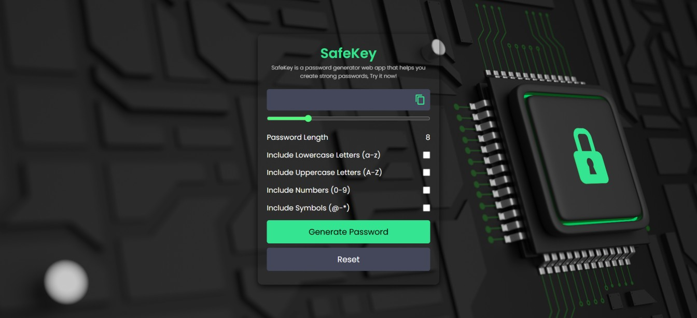

# SafeKey

SafeKey is an open source password generator designed to help users create strong, random passwords to protect their online accounts. It is simple to use, highly customizable, and ensures maximum security by generating unique passwords for each use. SafeKey is completely free and runs entirely in your browser for privacy and security.

## 🔐 Demo Screenshot



## 🔗 Live Demo

Check out the app live here: **[SafeKey](https://premkrrajbhar.github.io/SafeKey/)**

## 📋 Features

- **Random Password Generation**: Generate strong passwords with a variety of character types (letters, numbers, symbols).
- **Customizable Options**: Choose to include or exclude uppercase, lowercase, numbers, and special characters based on your needs.
- **Instant Password Copying**: Easily copy the generated password to your clipboard with one click.
- **No Data Storage**: SafeKey does not store or share any passwords you generate. All operations happen directly in your browser.
- **Completely Free**: SafeKey is free to use with no hidden charges.

## 🛠️ Technologies Used

- **HTML** Structure of the web page.
- **Bootstrap** for responsive layout.
- **CSS** for fix some elements and background colors.
- **JavaScript** Logic for password generation and interactions.
- **AOS library** for smooth animation when scrolling website.
- **Font Awesome** implements icons for various UI elements.
- **Random user generator** website for generating random profile pictures for the testimonial section.
- **Flaticon** provides icons used in the home section.

## 🚀 How to Use

- Step1. Adjust the password length using the slider.
- Step2. Select character types (Lowercase, Uppercase, Numbers, Symbols).
- Step3. Click **"Generate Password"** to create a secure password.
- Step4. Click the **copy icon** to copy the generated password.
- Step5. Use the **reset button** to clear selections and reset settings.

## 📂 Project Structure

```
├── LICENSE
├── README.md
├── assets
│   ├── favicon
│   │   └── safekey-favicon.png
│   ├── images
│   │   ├── img-1.png
│   │   ├── testimonal-img1.jpg
│   │   ├── testimonal-img10.jpg
│   │   ├── testimonal-img11.jpg
│   │   ├── testimonal-img12.jpg
│   │   ├── testimonal-img2.jpg
│   │   ├── testimonal-img3.jpg
│   │   ├── testimonal-img4.jpg
│   │   ├── testimonal-img5.jpg
│   │   ├── testimonal-img6.jpg
│   │   ├── testimonal-img7.jpg
│   │   ├── testimonal-img8.jpg
│   │   └── testimonal-img9.jpg
│   ├── logo
│   │   └── safekey_logo.png
│   └── screenshot
│       └── screenshot.jpg
├── css
│   └── style.css
├── index.html
└── script
    └── script.js

```

## 📥 How to Run Locally

- Step 1: Clone the repository:

```bash
git clone https://github.com/premkrrajbhar/SafeKey.git
```

- Step 2: Navigate to the project folder:

```bash
cd SafeKey
```

- Step 3: Open `index.html` in your web browser.

## 📝LICENSE

SafeKey is open-source software released under the MIT License. This means you are free to use, modify, and distribute the code as per the terms of the MIT license. See the [LICENSE](/LICENSE) file for more information.

## 🤝 Contributing

Contributions are welcome! Feel free to submit a pull request or open an issue.

## 📞 Contact

For any questions or feedback, reach out to:

- **Email**: [premkumar224487@gmail.com](mailto:premkumar224487@gmail.com)
- **GitHub**: [premkrrajbhar](https://github.com/premkrrajbhar)
