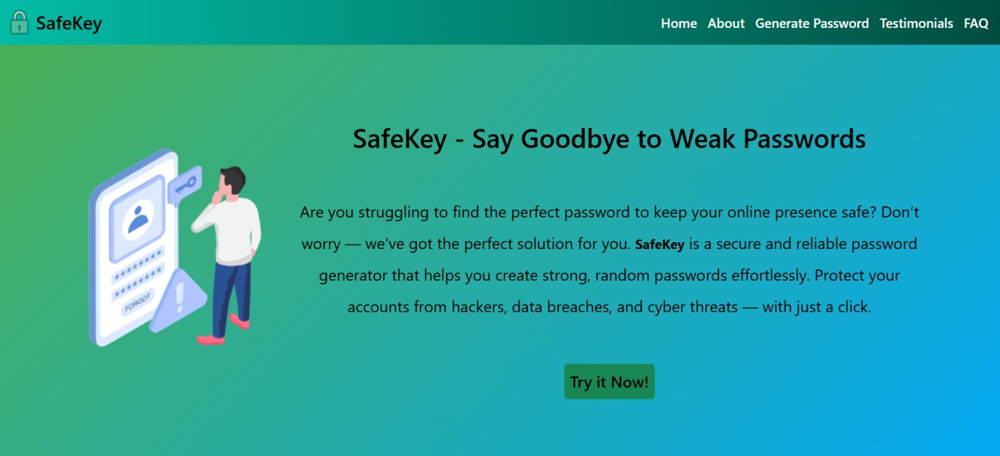

# SafeKey

SafeKey is a secure and reliable password generator that helps you create strong passwords effortlessly. Protect your accounts from cyber threats.

## 🔐 Demo Screenshot



## 🔗 Live Demo

Check out the app live here: **[SafeKey](https://premkrrajbhar.github.io/SafeKey/)**

## 📋 Features

- **Generate Strong Passwords** using customizable options.
- **Adjust Password Length** with a slider.
- **Include/Exclude Characters**: Lowercase, Uppercase, Numbers, Symbols.
- **Copy to Clipboard** for quick access.
- **Reset Options** to default settings.

## 🛠️ Technologies Used

- **HTML** – Structure of the web page.
- **CSS** – Styling for an intuitive UI.
- **JavaScript** – Logic for password generation and interactions.

## 🚀 How to Use

- Step1. Adjust the password length using the slider.
- Step2. Select character types (Lowercase, Uppercase, Numbers, Symbols).
- Step3. Click **"Generate Password"** to create a secure password.
- Step4. Click the **copy icon** to copy the generated password.
- Step5. Use the **reset button** to clear selections and reset settings.

## 📂 Project Structure

```
├── README.md
├── assets/
│   ├── favicon/
│   │   └── safekey-favicon.png
│   └── screenshot/
│       └── screenshot.jpg
├── css/
│   └── style.css
├── image/
│   └── bg-img.jpg
├── index.html
└── script/
    └── script.js
```

## 📥 How to Run Locally

- Step 1: Clone the repository:

```bash
git clone https://github.com/premkrrajbhar/SafeKey.git
```

- Step 2: Navigate to the project folder:

```bash
cd SafeKey
```

- Step 3: Open `index.html` in your web browser.

## 🤝 Contributing

Contributions are welcome! Feel free to submit a pull request or open an issue.

## 📞 Contact

For any questions or feedback, reach out to:

- **Email**: [premkumar224487@gmail.com](mailto:premkumar224487@gmail.com)
- **GitHub**: [premkrrajbhar](https://github.com/premkrrajbhar)

